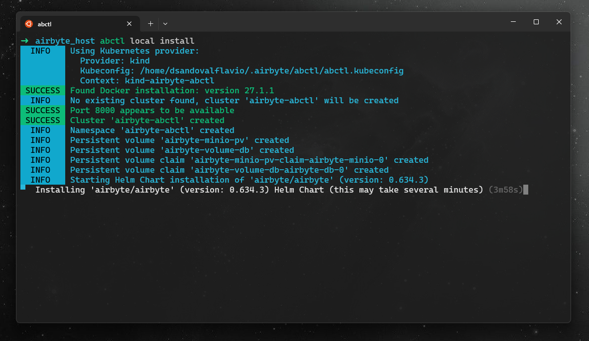

## Introducción a Airbyte y su instalación con WSL

### ¿Qué es Airbyte?

Airbyte es una plataforma de código abierto para la integración de datos, diseñada para ayudarte a consolidar datos de diversas fuentes en tus almacenes de datos, data lakes y bases de datos.

* **Airbyte Cloud:** Solución gestionada en la nube para una configuración y escalabilidad sencillas.
* **Self-Managed Community (OSS):** Versión de código abierto para un control total y personalización.
* **Self-Managed Enterprise:** Versión empresarial para grandes organizaciones con necesidades avanzadas.

### Instalación de Airbyte con WSL

#### Requisitos Previos

* **Docker Desktop:** Asegúrate de tener Docker Desktop instalado en tu sistema. Sigue las instrucciones de Docker para la instalación en [Mac](https://docs.docker.com/desktop/mac/install/), [Windows](https://docs.docker.com/desktop/windows/install/) o [Linux](https://docs.docker.com/engine/install/).
* **WSL (Subsistema de Windows para Linux):** Si estás en Windows, necesitarás tener WSL habilitado y configurado. Puedes seguir la guía de Microsoft para [instalar WSL](https://learn.microsoft.com/es-es/windows/wsl/install).

#### Pasos de Instalación



1. **Instalar `abctl`**

   La forma más sencilla de instalar `abctl` (Airbyte Command Line Tool) en WSL es usar el siguiente comando:

   ```bash
   curl -LsfS https://get.airbyte.com | bash -
   ```

2. **Ejecutar Airbyte**

   * Asegúrate de que Docker Desktop esté en ejecución.
   * Con `abctl` instalado, ejecuta el siguiente comando para iniciar Airbyte:

     ```bash
     abctl local install
     ```

   * Si deseas acceder a Airbyte desde fuera de `localhost`, especifica la bandera `--host` al comando de instalación, proporcionando el FQDN del host que aloja Airbyte. Por ejemplo:

     ```bash
     abctl local install --host airbyte.midominio.com
     ```

3. **Acceder a Airbyte**

   * Tu navegador podría abrir automáticamente la aplicación de Airbyte. Si no, accede a ella visitando `http://localhost:8000`.
   * Se te pedirá que ingreses tu dirección de correo electrónico y un nombre de organización.
   * Para obtener tu contraseña generada aleatoriamente, ejecuta:

     ```bash
     abctl local credentials
     ```

   * Utiliza la contraseña proporcionada para autenticarte en tu nueva instancia de Airbyte.

**¡Listo!** Ahora tienes Airbyte ejecutándose en tu sistema WSL, y puedes comenzar a explorar sus capacidades para la integración de datos. 